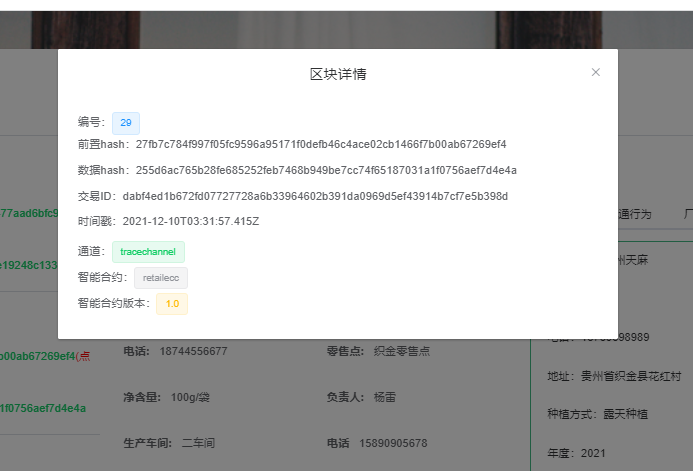

# 基于 Fabric 的溯源系统

# 介绍

基于区块链的溯源系统，分为 pc 端，h5 端，后台采用 SpringBoot，前端 Vue，
区块链网络采用 Fabric，一共分为六个组织节点，农户，原料厂商，生产厂商，物流厂商，零售商，消费者

若有疑问，可关注公众号获取联系方法，点击联系作者，消息回晚了别在意，都会回复的(出怎么安装 mysql，redis，数据库怎么连不上，redis 怎么连不上等问题)，感谢您的支持。

# 软件架构

此系统有四个模块， blockchain-trace-bcnetwork ，blockchain-trace-applets ，blockchain-trace-pc ，blockchain-trace-basic-data。

    blockchain-trace-bcnetwork：区块链网络，可直接将文件上传至服务器，然后启动里面的脚本

    blockchain-trace-applets：小程序端溯源，做得十分简单

    blockchain-trace-pc：PC端,使用的是RuoYi-Vue

    blockchain-trace-basic-data：系统基础数据后台，使用的是RuoYi

    前端：Vue.js , Element UI , mpvue

    后端：SpringBoot , Mybatis , FastDFS , Node.js , Redis , MySQL

    区块链：Fabric1.2

    智能合约：Golang语言编写

    环境：Ubuntu16.04 64位(2核 4G以上)，Docker 18.09.7 , Docker-compose 1.29.1 ,

# 安装教程

## 一.fabric 网络

### 1.确保环境配置好

> node.js 12.\*

> docker

> docker-compose

> Redis

> FastDFS

> Mysql8

> go 语言环境

### 2.拉取 docker 镜像

#### pull

```
docker pull hyperledger/fabric-peer:1.2.0 &&
docker pull hyperledger/fabric-orderer:1.2.0 &&
docker pull hyperledger/fabric-ca:1.2.0 &&
docker pull hyperledger/fabric-tools:1.2.0 &&
docker pull hyperledger/fabric-ccenv:1.2.0 &&
docker pull hyperledger/fabric-baseimage:0.4.10 &&
docker pull hyperledger/fabric-baseos:0.4.10 &&
docker pull hyperledger/fabric-couchdb:0.4.10
```

#### tag

```
docker tag hyperledger/fabric-peer:1.2.0 hyperledger/fabric-peer &&
docker tag hyperledger/fabric-orderer:1.2.0 hyperledger/fabric-orderer &&
docker tag hyperledger/fabric-ca:1.2.0 hyperledger/fabric-ca &&
docker tag hyperledger/fabric-tools:1.2.0 hyperledger/fabric-tools &&
docker tag hyperledger/fabric-ccenv:1.2.0 hyperledger/fabric-ccenv &&
docker tag hyperledger/fabric-baseimage:0.4.10  hyperledger/fabric-baseimage &&
docker tag hyperledger/fabric-baseos:0.4.10 hyperledger/fabric-baseos &&
docker tag hyperledger/fabric-couchdb:0.4.10 hyperledger/fabric-couchdb
```

### 3.上传代码到 linux 服务器/获取直接 git 拉取

`blockchain-trace-bcnetwork`

### 4.运行 basic_network 目录下的 start.sh 文件

> chmod -R 777 start.sh

> ./start.sh

此处会安装可能会出现问题，具体问题可以百度

参考：

```
https://blog.csdn.net/liqiang458473/article/details/80908919
https://blog.csdn.net/wzygis/article/details/85158859
```

### 5.运行 webapp 目录下的./start.sh

先给 webapp 目录下的所有 sh 文件授权，如下

```
chmod -R 777 startFarmerCC.sh
```

### 6.执行 npm install 安装依赖

> npm install

可能 node 版本问题安装会出一些问题，尽量保持版本为 12.\*

### 7.安装用户密钥

> node enrollAdmin.js

> node registerUser.js

执行 node registerUser.js 可能会安装失败，请删除一下 hfc-key-store 后重新执行，如果还是失败，可能就是 npm install 出问题。

### 8.启动 node 服务(node 服务就是一个中间件，连接前端和区块链网络)

> node app.js

如果需要让其常驻后台，需要安装 pm2。

> 启动：pm2 start app.js

> 停止：pm2 stop app.js

到这里，区块链网络就部署完成

## 二.系统基础数据后台 blockchain-trace-basic-data，是一个 SpringBoot 项目

### 1.修改 application.yml 文件中的 Redis 地址和 fastdfs 地址

```yaml
# redis 配置
redis:
  # 地址
  host: 127.0.0.1
  # 端口，默认为6379
  port: 6379
  # 密码
  password:

fdfs:
  so-timeout: 1501
  connect-timeout: 601
  thumb-image:
    width: 60
    height: 60
  tracker-list: 127.0.0.1:22122
  address: 127.0.0.1
```

### 2.修改 application-druid.yml 文件中 mysql 地址

```yaml
# 数据源配置
spring:
  datasource:
    type: com.alibaba.druid.pool.DruidDataSource
    driverClassName: com.mysql.cj.jdbc.Driver
    druid:
      # 主库数据源
      master:
        url: jdbc:mysql://127.0.0.1:3306/blockchain?useUnicode=true&characterEncoding=utf8&zeroDateTimeBehavior=convertToNull&useSSL=true&serverTimezone=GMT%2B8
        username: root
        password: root
```

## 三.PC 端（blockchain-trace-pc）

### 1.安装依赖

> npm install --registry=https://registry.npm.taobao.org

### 2.修改连接区块链网络地址

main.js，修改为区块链网络所在服务器地址

```yaml
Vue.prototype.$httpUrl = "http://localhost:8080/route";
```

### 3.启动项目

> npm run dev

## 四.小程序（blockchain-trace-applets）

自己使用开发者工具打开

## 界面

区块链浏览器


基础数据


添加农作物


农作物链上详情


农作物种植过程记录


物流追踪（因本系统，这里忘记去做了，只是模拟了一下）


司机运输定位（本系统采用 PC 端定位，实际上这是不行的，你想想，司机在开车过程中还要去打开浏览器进入系统去定位？这里只是模拟 ）


原料厂商质检报告上链


生产厂商部分截图


零售商生成产品唯一溯源 ID


pc 溯源



小程序端溯源


